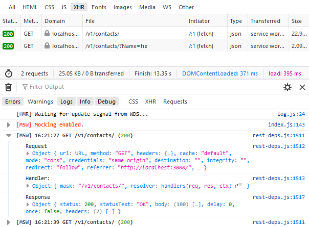

## Overview


End user can manage contact information in this application, which support filtering and searching to narrow the contact list. The **Name** column can be clicked to navigate to detail page.

## Tool Chains

- [Create React App](https://github.com/facebook/create-react-app) to bootstrap this project.
- [Redux](https://redux.js.org/) and [Redux Toolkit](https://redux-toolkit.js.org/) for state management.
- [React Router](https://reactrouter.com/web/guides/quick-start) as client side router.
- [Mock Service Worker](https://mswjs.io/docs/) mocking API by intercepting requests on the network level.

## API Mock

Mock Service Worker (a.k.a. msw) is an API mocking library that uses Service Worker API to intercept actual requests.



The project use [msw](https://mswjs.io/docs/) to intercept HTTP request, and response data for consuming by frontend.

1, Mocking REST API in `src\mocks\handlers.ts`

```ts
import { rest } from "msw";

export const handlers = [
   rest.get(contactsURL, (req, res, ctx) => {

   // Implement handler logic here
   return res(ctx.status(200));
}),
```

2, configure worker in `src\mocks\browser.ts`

```ts
import { setupWorker } from "msw";
import { handlers } from "./handlers";

export const worker = setupWorker(...handlers);
```

3, Start msw in `src\index.tsx`

```ts
if (process.env.NODE_ENV === "development") {
  const { worker } = require("./mocks/browser");

  worker.start();
}
```

## Improvement

- Benefit performance from [`React.lazy`](https://reactjs.org/docs/code-splitting.html#reactlazy) and [`Route-based code splitting`](https://reactjs.org/docs/code-splitting.html#route-based-code-splitting).
- Handle exceptions for both `HTTP` request and code.
- Cache data from respondence.
